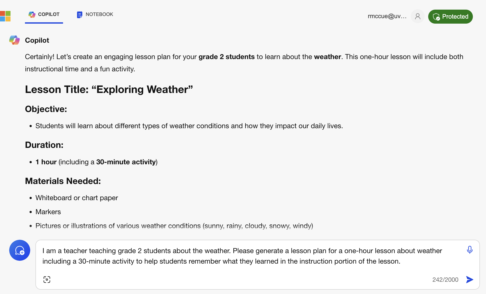

---
layout: default
title: 1 - Prompt Design & Idea Generation
nav_order: 3
parent: Workshop Activities - Introduction
customjs: http://code.jquery.com/jquery-1.4.2.min.js
--- 

# Prompt Design & Idea Generation

If you have any questions or get stuck as you work through this in-class GenAI exercise, please ask the instructor for assistance.  Have fun!

## Prompt Design
### Prompt Design Basics
While it is easy to get started using Generative AI tools, it takes time and practice to get the best results out of Generative AI tools. 
Here are some key principles to keep in mind as you create your own prompts:
1. **Be Clear & concise** in your language to avoid ambiguity:
  - Poor: "Weather?"
  - Better: "What is the current weather in Victoria, BC, Canada?
2. **Provide Specific details** to guide the AI toward the desired response:
  - Poor: "Tell me about the weather."
  - Better: "Provide a detailed weather forecast in 500 words or less, for Victoria, BC, Canada, for the next three days, including temperature, precipitation, and wind speed."
3. Include **relevant Context** & **Instruction** to help the AI understand the prompt better:
  - Poor: "Tell me about the weather."
  - Better: "I am a teacher teaching grade 2 students about the weather. Please generate a lesson plan for a one-hour lesson about weather including a 30-minute activity to help students remember what they learned in the instruction portion of the lesson."

### Let's Practice!
1. If you haven't already, please [**open Microsoft Copilot**](https://copilot.microsoft.com/){:target="_blank"}. If you are a UVic student you can use a version of Copilot licensed for you by UVic by logging on with your UVic email address (e.g. _noahsmith@uvic.ca_). The UVic version of Copilot runs on servers located in Canada and does not share any of the prompts you create with Microsoft, or resulting data for training data, which is great from a privacy perspective. 
> Note: You are free to use other GenAI tools like [ChatGPT](https://chat.openai.com/){:target="_blank"} and [Google Gemini](https://gemini.google.com/){:target="_blank"} for this workshop, but you will either have to create accounts for these services if you have not already done so, and will need to take extra steps to preserve your privacy.
2. Test a poor prompt to start with. Copy and paste the following text into your GenAI tool and note the results:<br>
```Tell me about the weather.```<br>
<br><br>
  - What are the results from this prompt telling you?
3. Now let's try a prompt that includes more details relevant to the hypothetical help we need by copying and pasting the following text into Copilot:
<br>```I am a teacher teaching grade 2 students about the weather. Please generate a lesson plan for a one-hour lesson about weather including a 30-minute activity to help students remember what they learned in the instruction portion of the lesson. Please provide sources.```<br>
<br><br>
>  - **How does the response to this prompt differ from the "_poor_" prompt above?**
>  - **Do you have the weather-related expertise to determine if the weather-related facts are accurate?**
>  - **Do you have the teaching expertise to know if the weather lesson plan is reasonable and will work well with grade 2 students?**
> <br>_Note: every time we use GenAI tools we should ask ourselves whether or not we have the expertise to evaluate the accuracy of GenAI-generated text, because as we know they are not always accurate or factual._
4. Pick one or two topics that you know a lot about (e.g. ```What are the origins of skateboarding?```).
  - **Ask Microsoft Copilot a question about one of the topics.**
  - **Is the answer accurate?**
  - **Can you make it more accurate with follow-up prompts?**
  - **Ask Copilot a question about your second topic.**
  - **How did it do for each topic?**
     - **Was it completely accurate?**
     - **Did you have to research to verify any of the claims Copilot made?**

### More Advanced Prompt Design Tips & Tricks
Please practice each of the following tips by trying out the _"poor"_ and _"better"_ prompts to compare the outputs. If you have time take inspiration from each of the _"better"_ prompts and modify them to use questions for topics that you are interested in, or know a lot about so that you can more easily check the responses for accuracy. Feel free to try modifying the prompts for topics or places that interest you.
1. Clicking the **New Topics** button in Copilot when you are asking a diffrent question that does not build on any previous questions you've asked Copilot will generally give you better results:
<br><br>
2. Set the **Tone of the response** you would like (e.g., formal, informal, humorous):
  - Poor: ```Weather in Paris.```
  - Better: ```Give me a lighthearted weather update for Paris, France, with a humorous twist.```
  - Use your own prompt now and experiment with varying the tone you request.
3. **Incorporate examples** or analogies to clarify complex concepts:
  - Poor: ```Explain cyclones.```
  - Better: ```Explain how cyclones form, using the example of Cyclone Nisarga. Please provide sources.```
  - Use your own prompt now and experiment with requesting the GenAI use an example or analogy.
4. **Limit Scope** to focus on a specific topic or task to prevent overly broad responses:
  - Poor: ```Tell me everything about weather.```
  - Better: ```Provide an overview of the factors that influence the formation of thunderstorms.```
  - Use your own prompt now and experiment with limiting the scope of your request.
5. **Test and Iterate** by experimenting with different variations of your prompt to see which yields the best results:
  - Initial: ```Weather in London.```
  - Refined: ```What is the weather forecast for London, UK, for the upcoming weekend, including any weather warnings? Provide sources.```
  - Use your own prompt now and experiment with iterating or refining your request.
6. **Prompt Chaining** by using the output of one prompt as the input for another to build on responses or refine results:
  - First Prompt: ```What are the key factors that affect local weather conditions?```
  - Second Prompt (following the first response): ```Considering those factors, what is the likely weather forecast for San Francisco next week? Provide sources.```
  - Use your own prompt now and experiment with prompt chaining.
7. **Leverage Precedents** by incorporating elements of successful prompts you've used in the past:
<br>
  - Previous Successful Prompt: ```Explain the concept of EL NIÑO and its impact on global weather patterns.```
  - New Prompt (leveraging precedent): ```Explain the concept of LA NIÑA and its impact on global weather patterns. Provide sources.```
8. **Create an Image** in Copilot. The image to the right was created by Copilot using the prompt below. Be sure to take a close look at the child's left hand, and notice the extra finger that Copilot has accidentally included. GenAI image generators will sometimes do weird things.
(Note: The free version ChatGPT (3.5) as of March 2024 does not allow users to generate images):
  - Successful prompt: ```Create an image of a grade 2 student learning about the weather.```
  - Use your own prompt now and experiment with creating your own images.

### Let's Practice More Advanced Prompt Design skills!
1. Let's use the topic of Global Warming to practice using some advanced prompt design techniques. Type or copy and paste the prompts below into Copilot and then let's look at the results:
  - Initial prompt:
<br>```What is global warming and what are its causes? Provide sources.```<br>
  - Scope:
<br>```Limit the text to 300 words in the language that a grade 4 student can understand.```<br>
  - Tone:
<br>```Reword it using the humorous tone and language of a Dr. Seuss book.```<br>
  - Image generation:
<br>```Create an image of a grade 4 student learning about the global warming.```<br>

  - Image modification:
<br>```Have the image use the look and feel of drawings from a Dr. Seuss book.```<br>
  - Start a "New topic" by pressing the blue button on the bottom left of the screen, and then paste in the following text and press enter:
<br>```I am a teacher teaching grade 4 students about the weather. Please generate a lesson plan for a one-hour lesson about weather including a 30-minute activity to help students remember what they learned in the instruction portion of the lesson.```<br>
  - Now look through the lesson plan and look at the "Activity" section. Let's ask Copilot to give us more details by asking the following:
<br>```Please provide additional and detailed step-by-step student instructions for the activity portion of the lesson plan.```<br>
2. Reflection time:
>  - **How useful is the lesson plan Copilot created?**
>  - **Do you have enough background knowledge in global warming and teaching to critically evaluate the quality of Copilot's response?**
>  - **How useful are the detailed activity instructions that Copilot created?**
>  - **Do you know enough to evaluate them? If not where would you find information to help you critically evaluate them?**

## Let's Practice Idea Generation!
> Please remember that **you must have permission from your instructor to use GenAI to assist you in any class assignment**. Your instructor may forbid the use of GenAI, allow limited use of GenAI, or all full use of GenAI for specific assignments. Please follow your instructors' guidelines for how to cite and document your use of GenAI in assignments. If you have any questions about using GenAI in your class, please look at your course outline, and if you don't find guidance there, ask your instructor directly, as using GenAI without permission from your instructor is a form of plagiarism and is a violation of UVic's [Academic Integrity Policy](https://www.uvic.ca/students/academics/academic-integrity/index.php). 

Now let's look at how we can use GenAI tools for creativity and innovation, including how to generate new ideas and overcome creative blocks ([ChatGPT 4.0, 2024](https://chat.openai.com/share/ec126ed8-937c-4f48-a322-cebde4bddd55){:target="_blank"}). Type or copy and paste the prompts below into Copilot and then let's look at the results.
1. First let's look at a technique to help us generate possible ideas for undergraduate honours research projects. Note that you probably won't get any truly unique topics suggested by GenAI tools, however, they can be useful for brainstorming and may prompt you to think of other related ideas as you look at what the GenAI tool has suggested.
  - Topic exploration: ```I am an undergraduate student getting ready to start an honours research project. I am interested in university-level academic makerspaces. What are some topics of inquiry that might be interesting for me to research or explore on this topic?```
  - Now try exploring a topic that you are interested in!
2. Research Question Formulation: ChatGPT can assist in refining research questions by providing feedback on clarity, focus, and feasibility.
  - Next, we'll take one of the bullet points from the Topic Exploration output, and add to the beginning of it: "Suggest 5 research questions with measurable outcomes for the following topic:"  This should provide us with ideas for research questions based on the topic. Note that even if you love one of the suggested research questions, you'll almost certainly modify it to suit your specific situation and possibly location. Here is an example:
<br>```Suggest 5 research questions for the following topic: Evaluate the effectiveness of makerspace programs. What assessment methods can be used to measure learning outcomes? How can we assess the impact of makerspaces on students’ employability?```
  - Now try using one of your own generated topics and request it to suggest research questions.
3. Summarize a document, but be very careful as currently (March 2024) **free GenAI tools have limits on the size of documents that they can summarize**. You can ask the GenAI tool to let you know if it can't "read" the whole article to summarize it.
  - Request a summary of an article titled, [LEGO helps Langford man recapture life after induced coma in 2018](https://www.saanichnews.com/local-news/lego-helps-langford-man-recapture-life-after-induced-coma-in-2018-7333837){:target="_blank"}, by opening the article, and copying the text of the article to use in the next step.
<br>```Please summarize the main points in this article. If you cannot summarize the whole article please tell me that you couldn't: https://www.saanichnews.com/local-news/lego-helps-langford-man-recapture-life-after-induced-coma-in-2018-7333837```<br>
  - Follup with the following prompt requesting a more detailed summary:
<br>```Please expand the summary to 5 or more bullet points.```<br>
  - Are the two summaries significantly different? If so in what ways?
  - Now try summarizing one of your own documents, or a web page!
> NOTE: The standard version of Copilot (which UVic has licenced for us) is not able to summarize large bodies of text, including documents over approximately 3,100 characters (as of March 2024). 
4. Reflection Time:
>  - **How useful were the research topic ideas that Copilot created?**
>  - **Do you have enough background knowledge to critically evaluate the quality of Copilot's suggested research topics?**
>  - **How useful were the research questions that Copilot created?**
>  - **Did Copilot do a good job in summarizing the document?**
  
## Go further
There are many excellent resources on the internet with tips and tricks for prompt design, to please feel free to go deeper with [articles like this](https://www.geeky-gadgets.com/prompt-engineering-techniques/){:target="_blank"} if you'd like to improve your prompt design skill set.

[NEXT STEP: Search for papers (literature reviews)](2-search-papers.html){: .btn .btn-blue }
