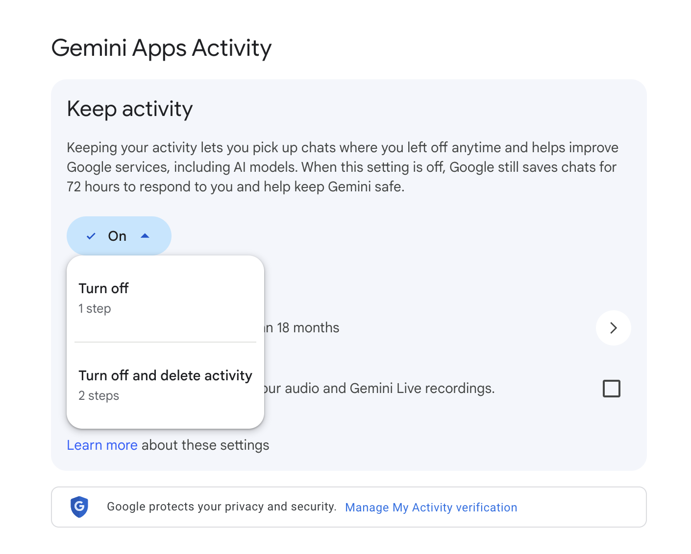
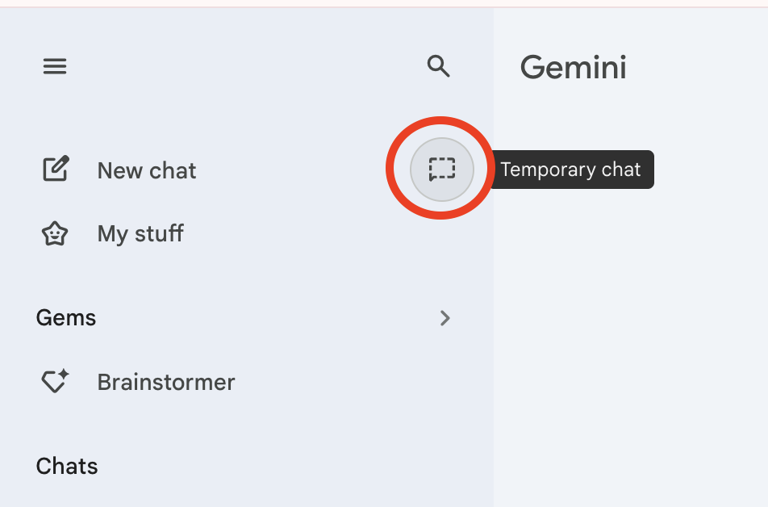

# Privacy, the Environment & Generative AI

GenAI tools are powerful—but they aren’t private by default, and heavy usage can be wasteful. This page shows how to protect personal/research data, set safer defaults in tools, and use GenAI more sustainably. If you get stuck, ask the instructor.

---

## What you’ll learn
- What data GenAI tools may collect (chat, files/links, metadata) and how to limit it.
- How to **redact** PII and sensitive info with reusable patterns.
- A quick **tool-hygiene** checklist (history, training, browsing, exports, deletion).
- File hygiene (metadata scrubbing for docs/images/audio).
- “Greener GenAI” habits that reduce waste.

> **Reminder:** Follow your instructors guidelines for the assignment your are working on and [UVic GenAI guidance](https://teachanywhere.uvic.ca/top-post/genai-position-statement/){:target="_blank" rel="noopener"} before using GenAI on assessed work or research data.

---

## What’s safe to paste? (fast classification)

| Category | Examples | OK to paste? | What to do |
|---|---|---|---|
| **Public** | Published article URL, press release | **Yes** | Cite source; still verify facts |
| **Internal (non-sensitive)** | Generic course info | **Yes, with care** | Avoid names/IDs; prefer paraphrase |
| **Personal/PII** | Names, emails, student IDs, phone numbers | **No (unless policy allows)** | **Redact** using placeholders (below) |
| **Sensitive** | Grades, health, HR/legal, confidential grants | **No** | Use approved secure workflows only |
| **Research data** | Non-public data, interviews, raw datasets | **No** | Use policy-approved/secure tools only |

### Redaction patterns you can reuse
Replace specifics with role-based placeholders **before** pasting:
- People: `Jane Smith` → `[Person_A]` (then `[Person_B]`, …)  
- Email: `jane@uvic.ca` → `[Email_1]`  
- Student ID: `V00xxxxxx` → `[ID_###]`  
- Organization: `Company X` → `[Org_A]`  
- Location: `Victoria, BC` → `[City_A]`  
- Dates: `2025-11-09` → `[Date_2025-11-09]` (keep meaning, hide ID)

Keep a tiny “redaction rules” note so you can reverse-map if needed.

---

## Privacy & data controls in tools

### UVic-licensed Microsoft Copilot
1. Sign in with your UVic account.  
2. Confirm you see the **green “Protected”** indicator at top right (UVic-licensed environment).  
3. Review data controls and browsing mode before pasting sensitive text.  
<br><br>

### ChatGPT (Data Controls)
1. Open **Settings → Data Controls**.  
2. Turn off content used to improve models; review chat history settings.  
<br>

### Google Gemini (Privacy)
1. Go to [gemini.google.com](https://gemini.google.com/){:target="_blank" rel="noopener"}.
2. Click the **Menu** icon (three horizontal lines) in the top-left corner.
3. Select **Settings & help** at the bottom of the sidebar.
4. Click **Activity** (this will open the Gemini Apps Activity page).
5. Find the Keep **Activity toggle** and click **Turn off**.
6. You will be prompted with two choices:
   - **Turn off**: Stops saving future chats for training.
   - **Turn off and delete activity**: Stops future training and wipes your existing history.

<br>

If you want to keep your main history on but have a specific conversation that is private and not used for training, use the new **Temporary Chat feature**.

- Look for the **model selector** at the top of the chat (where it says "Gemini 3").
- Click the dropdown and toggle on Temporary Chat.

**Privacy Note**: While in this mode, chats are deleted as soon as you close the window and are not used to train the model.  

<br>

> Policies and UI change over time. Confirm current settings each term and follow UVic policy.

---

## Tool-hygiene checklist (do this every time)
- **New chat per task** (prevents cross-contamination).  
- **History/training:** disable training on your content where possible.  
- **Browsing:** off unless you really need it.  
- **Sources:** demand links and dates; forbid guessing (“If unsure, say NOT SURE.”).  
- **Exports:** save what you need, then **delete** the conversation/file from the tool.  
- **Accounts:** prefer edu/enterprise accounts for school work when permitted.  
- **Policy:** when in doubt, don’t paste—summarize or use placeholders.

---

## File hygiene (docs, images, audio)
- **Docs (Word/PDF):** Inspect/Remove personal info (author, path).  
- **Images:** Strip EXIF (e.g., “Remove Properties”, or `exiftool -all= file.jpg`).  
- **Audio/video transcripts:** Replace names with `[Speaker_A]`, `[Speaker_B]`.  
- **Screenshots:** Crop out IDs, emails, and unique codes.  
- **Keep originals offline** when possible; paste only the **minimum** text needed.

---

## Greener GenAI: use less, get more
- Use **text & image** generation tools over video generation when possible.  
- **Specify length** (e.g., 120–150 words) and avoid repeated re-rolls.  
- Use **smaller models** and avoid **Deep Research** tools for simple tasks.  
- **Batch** questions into one structured prompt.  
- Reuse verified snippets/templates instead of starting from scratch.

---

## Hands-on drills (15–20 min)

### A) Redaction drill (8–10 min)
Paste a paragraph with names, emails, and an ID (create one if needed).  
**Prompt:**
```

Redact PII with role-based placeholders before we continue.
People -> [Person_A], [Person_B]
Emails -> [Email_1], [Email_2]
IDs -> [ID_###]
Return a diff-style list of replacements only.

```
**Acceptance:** all identifiers replaced; meaning preserved.

### B) Tool settings check (3–5 min)
Open your tool’s settings. Locate and toggle: history/training, browsing, data controls.  
**Acceptance:** you can point to each setting and explain what it does.

### C) Metadata clean (3–5 min)
Take an image or DOC/PDF and remove properties/EXIF.  
**Acceptance:** properties pane shows blanks for author, GPS, device.

> **Badge evidence:** screenshot of your redaction output and a settings screen.

---

## Environment: why usage habits matter

- Large models consume significant **energy** for training and inference; researchers urge pragmatic steps to limit impact ([Nature, 2024](https://www.nature.com/articles/d41586-024-00478-x){:target="_blank" rel="noopener"}).  
- **Water use** can rise for data-center cooling during model runs; several operators report increases while scaling AI ([Nature, 2024](https://www.nature.com/articles/d41586-024-00478-x){:target="_blank" rel="noopener"}).  
- Groups suggest **responsible development** and comparative **benefit–cost** evaluation to guide sustainable practices ([MIT Impact Climate, 2024](https://impactclimate.mit.edu/2024/04/10/considering-the-environmental-impacts-of-generative-ai-to-spark-responsible-development/){:target="_blank" rel="noopener"}; [HBR, 2023](https://hbr.org/2023/07/how-to-make-generative-ai-greener){:target="_blank" rel="noopener"}).

Focus on **right-sizing** tasks (see “Greener GenAI” above) and choosing efficient options when you can.

---

## Self-check (2 min)
- Did you **classify** data before pasting and **redact** PII?  
- Are tool **history/training** settings reviewed?  
- Did you strip **metadata** from any files you shared?  
- Did you keep the task **text-first** and **length-bound**?

---

[**NEXT STEP: Assignment Feedback (pre-submit check)**](6-assignment-feedback.html){: .btn .btn-blue }
```
