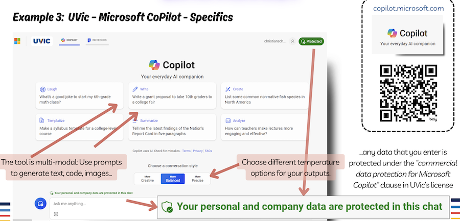
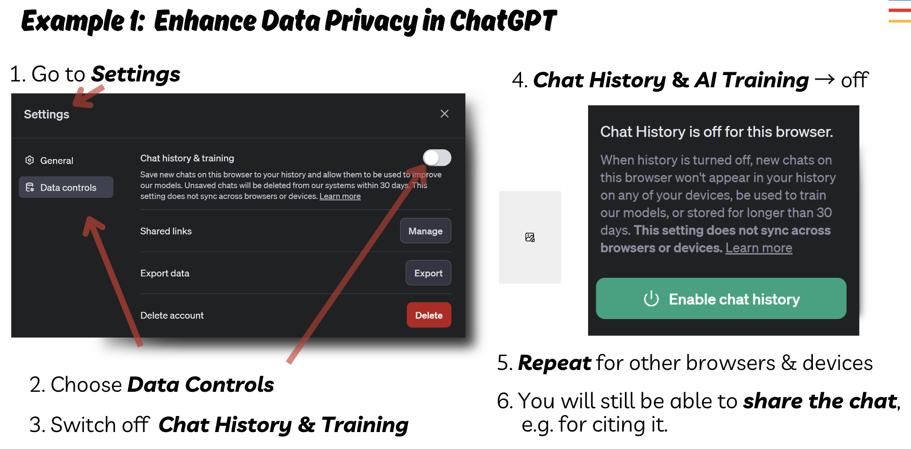
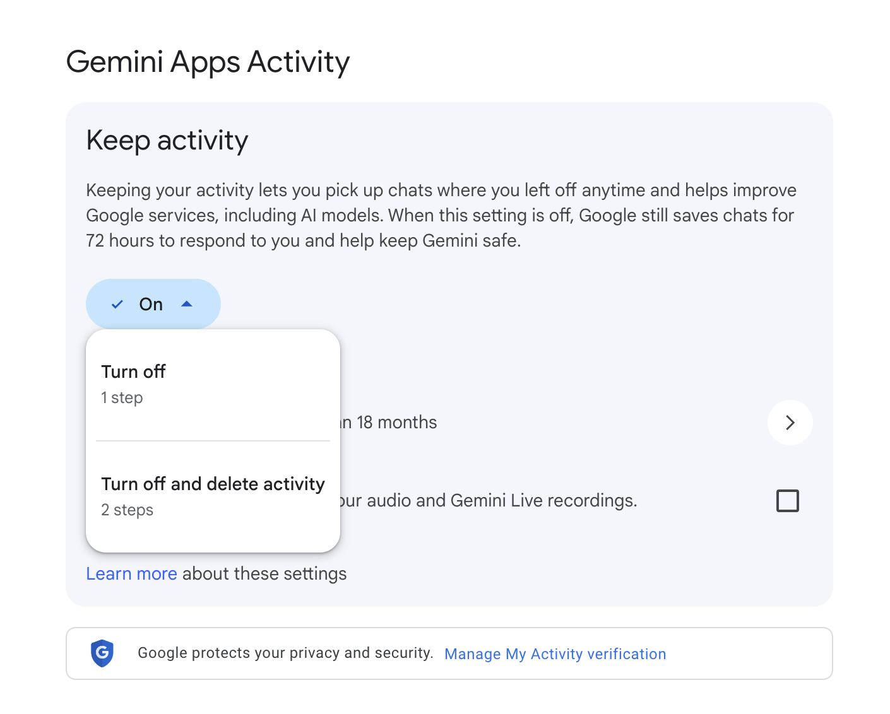
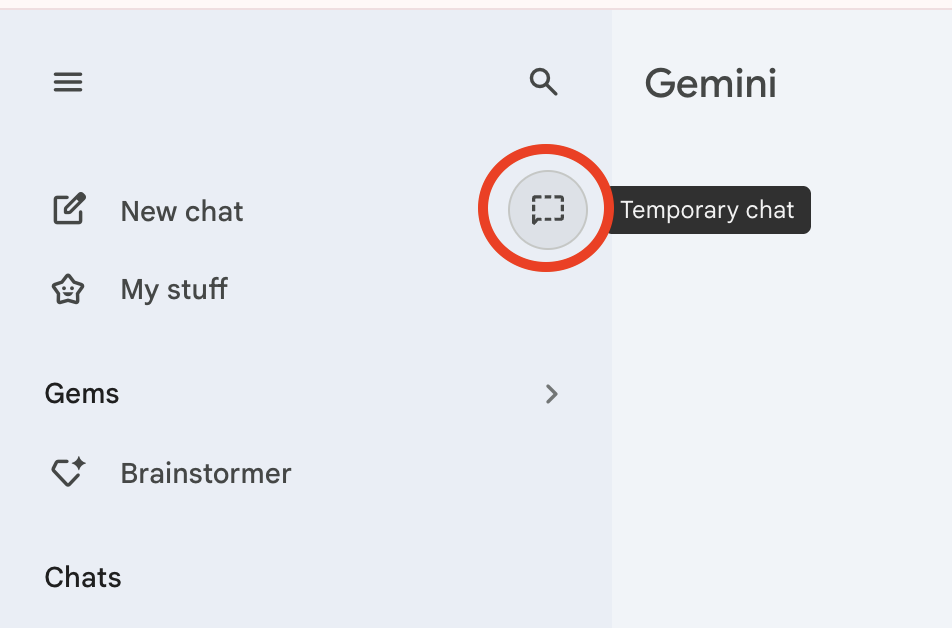

# Privacy & Data Safety

GenAI tools are powerful—but they aren't private by default. This page shows you how to protect personal and research data, set safer defaults in the tools you use, and keep your files clean before sharing. If you get stuck, ask the instructor.

> **Want to go deeper on AI's environmental footprint?** Energy use, water consumption, and data-centre sustainability are covered in depth in the **[Artificial Intelligence and the Environment](https://uviclibraries.github.io/genai-pathway/#introductory-workshops)** workshop. This page focuses on privacy and data safety only.

---

## What you'll learn

* What data GenAI tools may collect (chat history, files/links, metadata) and how to limit it.
* How to **redact** Personally Identifying Information (PII) with reusable placeholder patterns.
* A quick **tool-hygiene** checklist to run every time you use a GenAI tool.
* How to scrub metadata from docs, images, and audio files before sharing.

> **Reminder:** Follow your instructor's guidelines and [UVic GenAI guidance](https://teachanywhere.uvic.ca/top-post/genai-position-statement/) before using GenAI on assessed work or research data.

---

## What's safe to paste? (fast classification)

| Category | Examples | OK to paste? | What to do |
|---|---|---|---|
| **Public** | Published article URL, press release | **Yes** | Cite source; still verify facts |
| **Internal (non-sensitive)** | Generic course info | **Yes, with care** | Avoid names/IDs; prefer paraphrase |
| **Personally Identifying Information** | Names, emails, student IDs, phone numbers | **No (unless policy allows)** | **Redact** using placeholders (see below) |
| **Sensitive** | Grades, health, HR/legal, confidential grants | **No** | Use approved secure workflows only |
| **Research data** | Non-public data, interviews, raw datasets | **No** | Use policy-approved/secure tools only |

### Redaction patterns you can reuse

Replace specifics with role-based placeholders **before** pasting:

* People: `Jane Smith` → `[Person_A]` (then `[Person_B]`, …)
* Email: `jane@uvic.ca` → `[Email_1]`
* Student ID: `V00xxxxxx` → `[ID_###]`
* Organization: `Company X` → `[Org_A]`
* Location: `Victoria, BC` → `[City_A]`
* Dates: `2025-11-09` → `[Date_2025-11-09]` (keeps meaning, hides identity)

Keep a short "redaction key" note so you can reverse-map if needed.

---

## Privacy & data controls in common tools

### UVic-licensed Microsoft Copilot

1. Sign in with your UVic account.
2. Confirm you see the **green "Protected"** indicator at top right (UVic-licensed environment).
3. Review data controls and browsing mode before pasting any sensitive text.



### ChatGPT (Data Controls)

1. Open **Settings → Data Controls**.
2. Turn off content used to improve models; review chat history settings.



### Google Gemini (Privacy)

1. Go to [gemini.google.com](https://gemini.google.com/).
2. Click the **Menu** icon (three horizontal lines) in the top-left corner.
3. Select **Settings & help** at the bottom of the sidebar.
4. Click **Activity** to open the Gemini Apps Activity page.
5. Find the **Keep Activity** toggle and click **Turn off**.
   * **Turn off** — stops saving future chats for training.
   * **Turn off and delete activity** — stops future training and wipes existing history.



For a single private conversation without changing your main history, use **Temporary Chat**:

* Click the model selector at the top of the chat and toggle on **Temporary Chat**.
* Chats in this mode are deleted when you close the window and are not used for model training.



> Policies and UI change over time. Confirm current settings each term and follow UVic policy.

---

## Tool-hygiene checklist (do this every time)

* **New chat per task** — prevents context from one task contaminating another.
* **History/training** — disable training on your content where the tool allows it.
* **Sources** — demand links and dates; tell the tool not to guess ("If unsure, say NOT SURE.").
* **Exports** — save what you need, then **delete** the conversation or file from the tool.
* **Accounts** — prefer educational or enterprise accounts for school work when permitted.
* **Policy** — when in doubt, don't paste; summarize or use placeholders instead.

---

## File hygiene (docs, images, audio)

* **Docs (Word/PDF):** Inspect and remove personal metadata (author name, file path, revision history).
* **Images:** Strip EXIF data (e.g., "Remove Properties" in Windows, or `exiftool -all= file.jpg` in terminal).
* **Audio/video transcripts:** Replace speaker names with `[Speaker_A]`, `[Speaker_B]` before pasting.
* **Screenshots:** Crop out IDs, emails, and unique codes before sharing.
* **Keep originals offline** where possible; paste only the **minimum** text needed for the task.

---

## Hands-on drills (15–20 min)

### A) Redaction drill (8–10 min)

Write or paste a short paragraph containing a name, an email address, and an ID number (create fictional ones if you prefer).

**Prompt:**
```
Redact all Personally Identifying Information using role-based placeholders before we continue.
People → [Person_A], [Person_B]
Emails → [Email_1], [Email_2]
IDs → [ID_###]
Return a diff-style list of replacements only — do not rewrite the paragraph yet.
```

**Acceptance criteria:** all identifiers are replaced; the meaning of the paragraph is preserved.

### B) Tool settings check (3–5 min)

Open your tool's settings. Locate and toggle: history/training, browsing mode, and data controls.

**Acceptance criteria:** you can point to each setting and explain in one sentence what it does.

### C) Metadata clean (3–5 min)

Take any image or Word/PDF file and remove its properties or EXIF data.

**Acceptance criteria:** the properties pane shows blanks for author, GPS coordinates, and device information.

> **Badge evidence:** screenshot of your redaction output and a settings screen showing the controls you found.

---

## Self-check (2 min)

* Did you **classify** data before pasting and **redact** all PII?
* Are tool **history/training** settings reviewed and set appropriately?
* Did you strip **metadata** from any files you shared with the tool?
* Are you relying on the **minimum** text needed — nothing more?

---

[**NEXT STEP: Assignment Feedback (pre-submit check)**](6-assignment-feedback.html)
