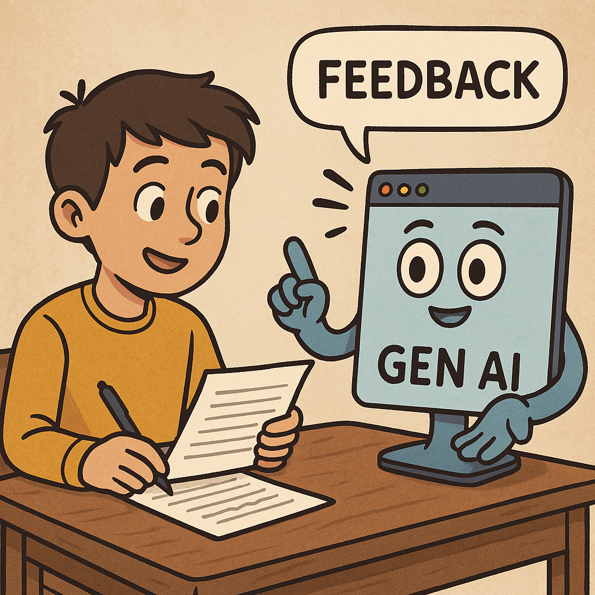

# Assignment Feedback or Formative Assessment

Let's start work on a practical exercise that will demonstrate the power of Generative AI as your personal assignment pre-submission feedback partner. In this hands-on activity, you'll experience firsthand how to effectively provide a GenAI tool with assignment instructions and your completed assignment. We'll then explore specific prompts you can use to gain valuable insights into whether you've fully addressed all aspects of the assignment and to receive targeted suggestions for enhancing the clarity and quality of your writing. 

If you have any questions or get stuck as you work through this in-class GenAI exercise, please ask the instructor for assistance.  Have fun!

## Privacy & Data Collection in UVic's Copilot
1. The good news is that UVic has turned on all the privacy features in the version of [Microsoft Copilot](https://copilot.microsoft.com){:target="_blank"} that they have licensed for the UVic community.
2. Please click on the green "Protected" button in the top right of the Copilot screen to confirm that you are using the UVic-licensed version, which means that you have strong privacy settings in place that cannot be changed (like they can in if you signed up individually for Copilot).
  

## Privacy & Data Collection in ChatGPT
1. The good news is that you can change the privacy setting in ChatGPT so that your user data and prompts are not used by ChatGPT as Training Data.
2. Follow the instructions below to stop ChatGPT from using your prompts as training data (note that this will also turn off your chat history which can be an inconvenience to some):

[NEXT STEP: Literature Review Activities](7-lit-review.html){: .btn .btn-blue }
