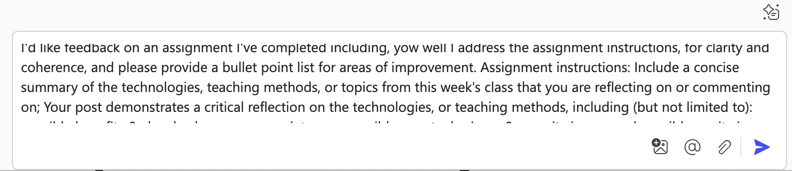
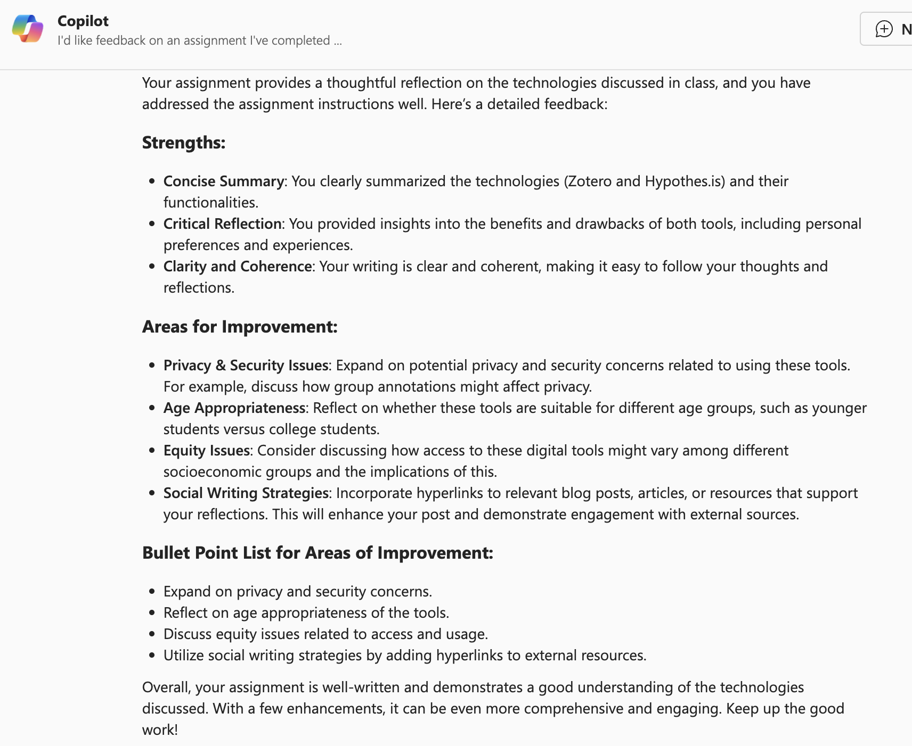
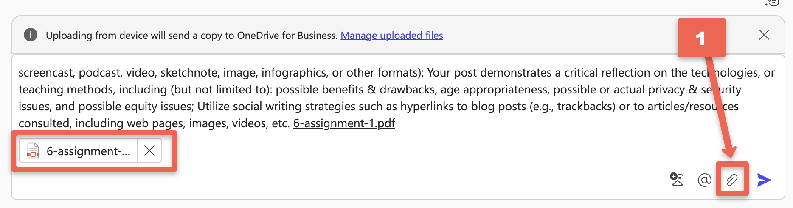
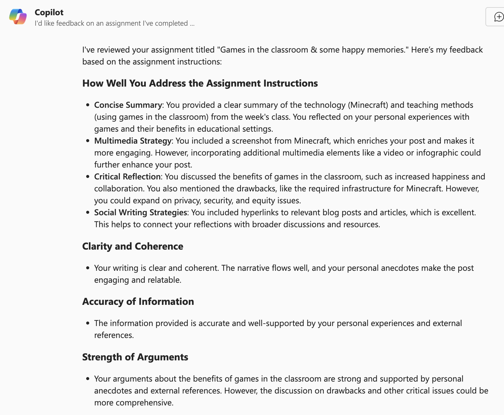

# Assignment Feedback (Pre-Submit Check)


Use GenAI to get **specific, auditable feedback**—then turn it into a short **fix plan** you can actually execute before you submit.

> **Integrity reminder:** Follow your course rules about GenAI. Redact names/emails/IDs (e.g., `[Person_A]`, `[Email_1]`). You are responsible for the final work; verify all facts and sources. UVic’s LTSI notes that **self-assessment with GenAI** is encouraged when permitted by your instructor ([LTSI, 2024](https://teachanywhere.uvic.ca/top-post/genai-position-statement/){:target="_blank" rel="noopener"}).

---

## What you’ll learn
- Build a small **rubric** (1–5) that matches your assignment.
- Ask for **structured comments** you can audit (with evidence quotes).
- Produce a **Top-5 Fix Plan** with locations, actions, and rationale.
- Optionally request **targeted rewrites** of flagged lines only.
- Document **how you used GenAI** (short attribution note).

## Before you start
- Have your draft (or a 1–2 paragraph sample) ready.
- Keep the **assignment instructions** handy.
- Redact PII in your draft (e.g., `[Person_A]`, `[Email_1]`).

---

## Quick start (copy/paste prompts)

### 1) Build a rubric (3–5 min)
```

Role: Writing TA
Action: Create a 5-point rubric for my assignment using these criteria:
Accuracy, Coverage, Clarity, Evidence & Citation, Argument/Structure, Style & Mechanics.
Format: Table with columns = Criterion, Score 1 descriptor, 3, 5.
Constraints: Keep each descriptor ≤15 words. Align to undergraduate expectations.

```

### 2) Score my draft (4–6 min)
_Paste your draft or an excerpt after the prompt._
```

Role: Writing TA
Action: Score my draft using the rubric above.
Format: Table = Criterion | Score(1–5) | Evidence from my draft (quote ≤10 words) | Fix suggestion (≤15 words)
Constraints: No full rewrites; be specific and verifiable.

```

### 3) Create a Top-5 Fix Plan (5 min)
```

Action: Produce a Top-5 Fix Plan ranked by impact.
Format: Table = Priority | Location (line/para) | Problem | Concrete change | Why it improves the rubric
Constraints: Each change ≤25 words; reference specific lines/paras.

```

**Do the fixes**, then re-score if time allows.

### Optional — Targeted rewrites only (5–10 min)
_Paste only the lines/paras you flagged in your plan._
```

Role: Writing coach
Action: Rewrite ONLY the flagged lines below.
Constraints: Preserve my voice; keep length similar; keep citations; do not invent sources; plain academic English.
Return: Side-by-side table with Original vs Revised (≤120 words per cell).

```

### Citation hygiene (2–3 min)
```

Action: List all claims in my draft that require citations.
Format: Table = Claim (≤15 words) | Suggested source type (peer-review, gov't, etc.) | Risk if uncited
Constraints: Do not fabricate specific sources; suggest only types/repositories.

```

**Attribution (if required by your instructor)**  
> “I used a generative AI assistant for structured feedback (rubric scoring, fix plan, and targeted clarity edits). I verified facts and added/corrected all citations myself.”

---

## Hands-on (10–20 min)
1) Build a rubric, score your draft, and generate a **Top-5 Fix Plan**.  
2) Implement at least **two** fixes.  
3) (Optional) Request **targeted rewrites** for flagged lines only.  
4) Run the **citation hygiene** prompt and add real sources.

> **Badge evidence:** screenshot of your rubric scoring table **and** your Top-5 Fix Plan.

---

## Guided examples (keep these screenshots)

### A. Text-only assignment
Use **Perplexity** or **Microsoft Copilot**:
1. Gather your **assignment instructions** and your **completed draft** (or use the sample below).  
2. Ask for rubric scoring and a Top-5 Fix Plan (see prompts above).  
3. Review feedback for errors/omissions before making changes.

**Assignment instructions (example):**
- Include a concise summary of the technologies, teaching methods, or topics from this week’s class.  
- Demonstrate critical reflection (benefits/drawbacks, age appropriateness, privacy/security, equity).  
- Use social writing strategies (hyperlinks to posts/resources consulted).

**Sample completed assignment text (example):**  
“Coming back from spring break, I felt ready to dive back into the semester and finish strong… [keep your original example text here]”

<br>
<br>

**Reflect**
- Did it suggest missing items from the instructions?  
- Any mistakes or weak advice?  
- Which two fixes will you implement first?

---

### B. Mixed-media assignment (PDF upload)
1. Open **Perplexity** or **Copilot**.  
2. Download the sample PDF: [sample completed assignment](images/6-assignment-1.pdf){:target="_blank" rel="noopener"}.  
3. Paste the **assignment instructions** (below), then **attach the PDF**, then request the rubric scoring and Top-5 Fix Plan.

**Assignment instructions (example):**
- Concise summary of this week’s technologies or methods.  
- Use text **and** at least one other medium (screencast, podcast, video, sketchnote, image, infographic).  
- Critical reflection (benefits/drawbacks, age appropriateness, privacy/security, equity).  
- Social writing strategies (hyperlinks to consulted resources).

<br>
<br>

**Reflect**
- Did the rubric surface missing media elements or weak evidence?  
- Are suggested changes concrete (location + action + why)?  
- What will you update now?

---

## Self-check (2 min)
- Do I have a **rubric table** with scores and evidence quotes?  
- Do I have a **Top-5 Fix Plan** with locations and actions?  
- Did I verify **facts** and add/format **citations**?  
- Does my draft now match **length** and **format** requirements?  
- If GenAI was used, did I include a **short attribution** if required?

---

## Templates (blank)

**Rubric (blank)**
| Criterion | 1 | 3 | 5 |
|---|---|---|---|
| Accuracy | | | |
| Coverage | | | |
| Clarity | | | |
| Evidence & Citation | | | |
| Argument/Structure | | | |
| Style & Mechanics | | | |

**Top-5 Fix Plan (blank)**
| Priority | Location | Problem | Concrete change | Why it improves |
|---|---|---|---|---|
| 1 |  |  |  |  |
| 2 |  |  |  |  |
| 3 |  |  |  |  |
| 4 |  |  |  |  |
| 5 |  |  |  |  |

---
Assignment Feedback: rubric-first scoring, structured comments, Top-5 Fix Plan, targeted rewrites, citation hygiene, attribution note`
[**NEXT STEP: Literature Review Helpers**](7-lit-review.html){: .btn .btn-blue }
```


