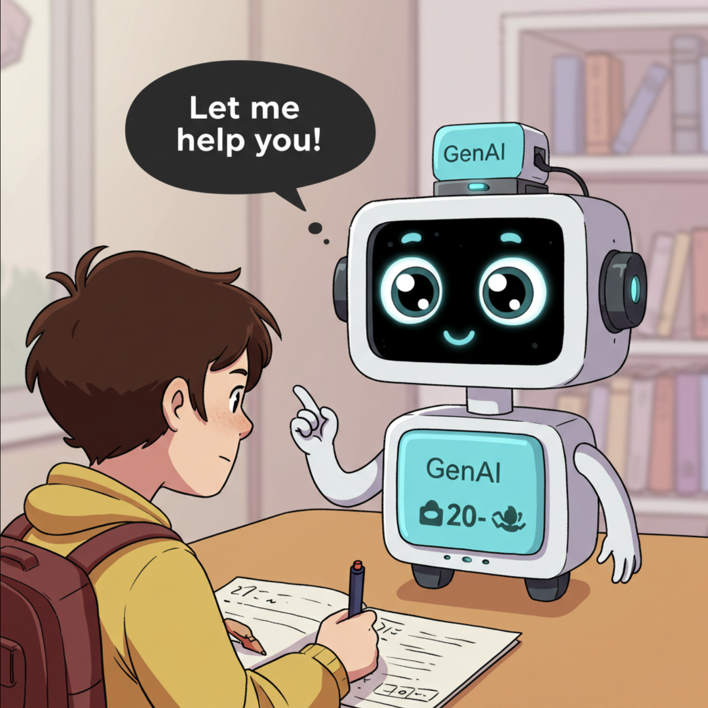

# ****  **UNDER CONSTRUCTION**  ****
# Assignment Feedback

Let's start work on a practical exercise that will demonstrate how GenAI tools can become your personal assignment pre-submission feedback partner. In this hands-on activity, you'll explore how to effectively provide a GenAI tool with assignment instructions along with your completed assignment to give you custom feedback. We'll then explore specific prompts you can use to gain valuable insights into whether you've fully addressed all aspects of the assignment and to receive targeted suggestions for enhancing the clarity and quality of your writing. 

If you have any questions or get stuck as you work through this in-class GenAI exercise, please ask the instructor for assistance.  Have fun!

## Let's Get Started
1. If you haven't already, in your favourite web browser please open either [**Perplexity.ai**](https://www.perplexity.ai/){:target="_blank"} (no account required) -OR- [**Microsoft Copilot**](https://copilot.microsoft.com/){:target="_blank"}.
3. We need two things in order to request feedback on an assignment you're ready to submit. You can use your own completed assignment and assignment instructions -OR- you can use the following sample completed assignment and assignment instructions:
   - [**Completed assignment**](images/6-assignment-1.pdf){:target="_blank"} (PDF download)
   - **Assignment instructions**:
      - Include a concise summary of the technologies, teaching methods, or topics from this week's class that you are reflecting on or commenting on;
      - Employ a multimedia strategy for your post by using text and one or more other media to enrich your post and help make it more engaging (e.g., screencast, podcast, video, sketchnote, image, infographics, or other formats);
      - Your post demonstrates a critical reflection on the technologies, or teaching methods, including (but not limited to): possible benefits & drawbacks, age appropriateness, possible or actual privacy & security issues, and possible equity issues;
      - Utilize social writing strategies such as hyperlinks to blog posts (e.g., trackbacks) or to articles/resources consulted, including web pages, images, videos, etc.
## Specify the Type of Feedback You Want
4. Specify the Type of Feedback You Need. Be specific about what kind of feedback you are looking for. For example, you could ask for feedback on:
   - Clarity and coherence
   - Accuracy of information
   - How well it addresses the assignment prompt
   - Grammar and spelling
   - Structure and organization
   - Strength of arguments (if applicable)
   - Areas for improvement
   - Specific sections or aspects of your work
5. Put together the **prompt**, the **assignment instructions**, and the **completed assignment**... 
5. Copy and paste the following prompt into Perplexity or Microsoft Copilot: ```I'd like feedback on an assignment I've completed, including feedback on completion o. Here are the assignment instructions: Include a concise summary of the technologies, teaching methods, or topics from this week's class that you are reflecting on or commenting on; Employ a multimedia strategy for your post by using text and one or more other media to enrich your post and help make it more engaging (e.g., screencast, podcast, video, sketchnote, image, infographics, or other formats); Your post demonstrates a critical reflection on the technologies, or teaching methods, including (but not limited to): possible benefits & drawbacks, age appropriateness, possible or actual privacy & security issues, and possible equity issues; Utilize social writing strategies such as hyperlinks to blog posts (e.g., trackbacks) or to articles/resources consulted, including web pages, images, videos, etc.```
6. Attach the completed assignment (the sample assignment is the PDF file you downloaded in Step 3).
7. Submit Your Request. Send your message containing the assignment instructions, your work, and your specific feedback requests to Gemini.
8. Review Gemini's Feedback. Gemini will process your input and provide feedback based on your request. Read the feedback carefully.
## Follow-up Questions or Prompts
8. Ask Follow-Up Questions (Optional). If you need clarification or have further questions about the feedback, don't hesitate to ask Gemini for more details or examples. You can engage in a dialogue to deepen your understanding.
9. Revise Your Work. Use the feedback you received from Gemini to revise and improve your assignment before submitting it. Example of how you might structure your conversation with Gemini:
- You: ```I'd like some feedback on an assignment I've completed. Here are the instructions: [Paste assignment instructions here]```
- You: ```Okay, here is my work: [Paste your assignment content here]```
- You: ```Could you please provide feedback on how well my work addresses all parts of the assignment, the clarity of my arguments, and any areas where I could improve the structure and organization? Thank you.```

By following these steps, you can effectively use Gemini to get valuable feedback on your assignments. Remember to be clear and specific in your requests to get the most helpful responses.

[NEXT STEP: Literature Review Activities](7-lit-review.html){: .btn .btn-blue }
