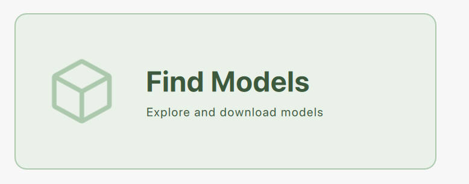
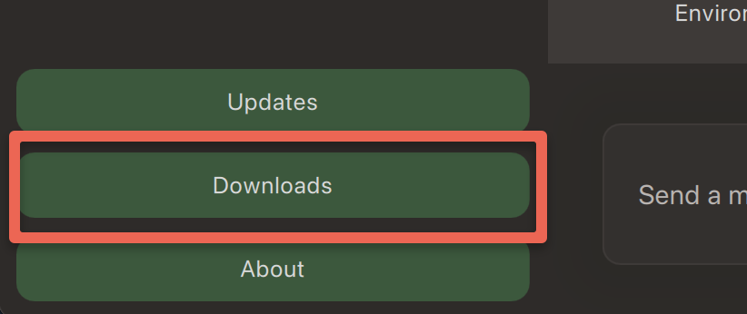

---
layout: default
title: 7 - Local GenAI - Getting Started
nav_order: 10
parent: Workshop Activities - Intermediate
customjs: http://code.jquery.com/jquery-1.4.2.min.js
--- 

# GPT4All on Your Laptop & Test It

If you have any questions or get stuck as you work through this GPT4All exercise, please ask the instructor for assistance.  Have fun!

## Installing GPT4All on Your Laptop
GPT4All is "a free-to-use, locally running, privacy-aware Large Language Model (LLM) chatbot" ([GPT4All](https://gpt4all.io/index.html){:target="_blank"}, 2024). GPT4All like other large language models can:
- Answer questions about the world
- Help you as a personal writing assistant
- Understand documents and give you answers about their content

There are many reasons to use a local GenAI tool like GPT4All as an alternative to ChatGPT and other GenAI tools, including:
- GPT4All is a completely offline application, so it can be used even if you don't have access to the internet.
- Being offline also means that all the data you share with it stays on your computer, and GPT4All's creators can't see any of your data or prompts.
- GPT4All allows you to query local documents in a folder on your laptop that you specify.

Let's get started installing and using GPT4All for basic tasks!

1. **Download GPT4All** onto your laptop. Please select the link for your operating system:
- [Mac Download](https://gpt4all.io/installers/gpt4all-installer-darwin.dmg){:target="_blank"}
<br>-OR-
- [Windows Download](https://gpt4all.io/installers/gpt4all-installer-win64.exe){:target="_blank"}
2. **Install GPT4All** on your laptop:
- **Mac Install**:
  - After downloading the installer, double-click on it.
  - Next, double-click on the _gpt4all-installer-darwin_ file and follow the installation instructions.
  - If you have any problems with the installation process, please ask your instructor for assistance.
- **Windows Install**: 
  - After downloading the installer, double-click on it.
  - Next, double-click on the _gpt4all-installer-win64_ file and follow the installation instructions.
  - If you have any problems with the installation process, please ask your instructor for assistance.

## Install a Language Model into GPT4All
Now we have _GPT4All_ installed on your laptop, we need to install a large language model before you can start asking it questions. There are a dozen or more models to choose from, but for now, we'll install one of the best overall models (as of Summer 2024) which is the _Llama 3 Instruct_ model. 

1. Click on the green **Find models** button to the right of the windows.
2. Take a look at all the models available to download, and then click on the green **Install** button beside the _Llama 3.2 8B Instruct_ model description.
> _Note: The download is quite large at 4.3GB so it may take a while for it to download. For this model, GPT4All recommends that your computer have at least 8GB of memory for your computer to run the model at a reasonable speed._ If you have any questions about this please ask your instructor.
4. Once the model has finished downloading, click on the green **Chats** button on the left navigation bar. Next, you can get down to business and start testing the language model's accuracy and speed!

## Test GPT4All's Accuracy & Speed
1. Before we can start testing, we need to tell GPT4All that we want to use the _Llama 3 Instruct_ model:
  - Click on the **Choose a model...** drop down box at the middle top of the window.
  - Select **Llama 3.2 8B Instruct** model. Depending on the speed of your laptop it should take between take 10 to 60 seconds for the model to finish loading.
<br>
3. Let's test _GPT4All & Llama 3 Instruct_ with a generic prompt to start with. Copy and paste the following text into the Send a Message field and review the results:<br>
```Why would someone want to attend the University of Victoria in Canada? Why might the university not be a good fit for someone? Provide citations.```<br>

  - How reasonable do the results look to you?
  - Do you notice any significant omissions from the "not be a good fit" section? Housing availability? Cost of living?
3. Now let's test GPT4All with something you know a lot about:
- For Example, personal questions might be a good place to start if there was enough information on the public internet for the language models to train on: ```What is Rich McCue from the University of Victoria known for?```
> Make sure to ask a question or two of your own, keeping in mind that it's best to ask about a topic that you know a lot about so that you can evaluate the accuracy of the results! 
> - Maybe a question about your home town?
> - Or a question about a recent research project that you've completed?
  
## Install and Test another Language Model
Let's try installing a second Language Model so that we can compare the results of the questions you've asked the _Llama 3 Instruct_ model with another model: 
1. On the bottom left of the GPT4All windows click on the green **Downloads** button. 
2. Scroll to find the **Nous Hermes 2 Mistral DPO** model, and then click on the green **Download** button to the right of the model description.
> _Note: The download is quite large at 4.3GB so it may take a while for it to download. For this model, GPT4All recommends that your computer have at least 8GB of memory for your computer to run the model at a reasonable speed._ If you have any questions about this please ask your instructor.
4. Once the model has finished downloading, click on the green **X** in the top right to close the "Discover and Download Models" window.
5. Before we can start testing the new model, we need to tell GPT4All that we want to use the _Nous Hermes 2 Mistral DPO_ model:
  - Click on the **Choose a model...** drop down box at the middle top of the window.
  - Select **Nous Hermes 2 Mistral DPO** model. Depending on the speed of your laptop it should take between take 10 to 60 seconds for the model to finish loading.
3. Let's test _GPT4All & Nous Hermes 2 Mistral DPO_ with a generic prompt to start with. Copy and paste the following text into the Send a Message field and review the results:<br>
```Why would someone want to attend the University of Victoria in Canada? Why might the university not be a good fit for someone? Provide citations.```<br>

  - How reasonable do the results look to you?
  - Do you notice any significant omissions from the "not be a good fit" section? 
  - Are there any major differences from the _Llama 3 Instruct_ response? Is there any mention of **Cost of living or Housing availability**?
3. Now let's test the _Nous Hermes 2 Mistral DPO_ model with something you know a lot about:
- For Example, personal questions might be a good place to start if there was enough information on the public internet for the language models to train on: ```What is Rich McCue from the University of Victoria known for?```
> Make sure to ask a question or two of your own, keeping in mind that it's best to ask about a topic that you know a lot about so that you can evaluate the accuracy of the results! 
> - Maybe a question about your home town?
> - Or a question about a recent research project that you've completed?

[NEXT STEP: Earn a Workshop Badge](informal-credentials.html){: .btn .btn-blue }
