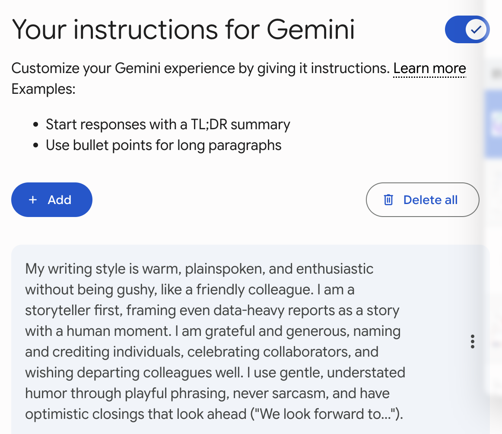
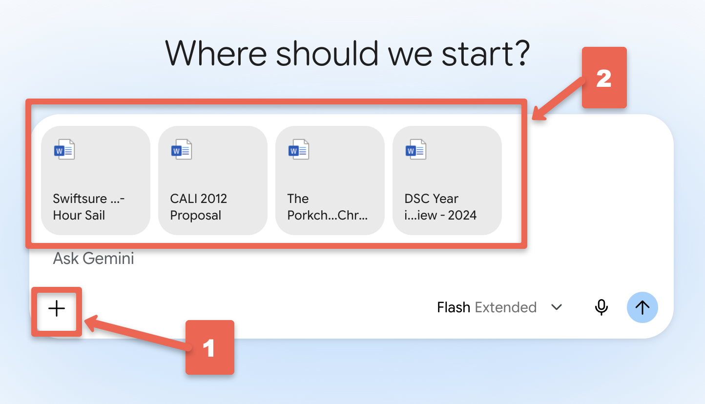
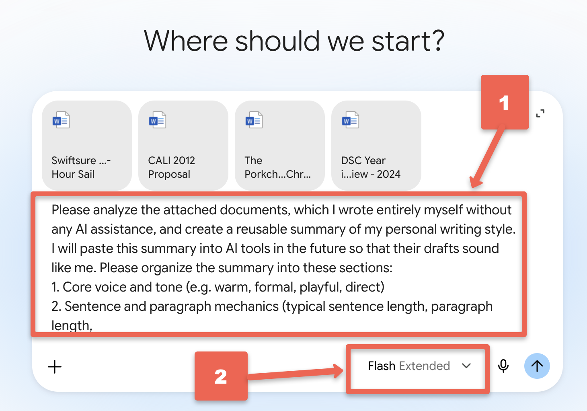

# Create a Personal Writing Style Guide for Your GenAI Tools!


Generative AI tools are wonderful writing assistants, but out of the box they all sound a little bit the same: polished, generic, and not quite like you. Fortunately, there is a simple fix. If you give a GenAI tool a few examples of your own writing, it can create a summary of your writing style, and you can then give that summary back to the tool so its drafts sound much more like your authentic voice.

In this activity you will gather at least 3 documents you wrote yourself without any GenAI help (the more documents the better), have a GenAI tool analyze them, refine the resulting style guide, and then learn how to save that guide in [Google Gemini](https://gemini.google.com/){:target="_blank"}, [Claude](https://claude.ai/){:target="_blank"}, and [ChatGPT](https://chatgpt.com/){:target="_blank"} so every future conversation starts with your voice already loaded.

If you get stuck, please ask your instructor for assistance, and don't forget to have fun!

Step 1
{: .label .label-step }

- Gather **at least 3 documents that you wrote entirely yourself, without using any GenAI tools**. The more variety the better, for example:
  * A work or school report, essay, or proposal.
  * A blog post, newsletter article, or social media post you are proud of.
  * A longer email or letter written in your natural voice.
- Aim for documents that are at least a few paragraphs long each (500 or more words is ideal). Short one-line emails don't give the AI enough to work with.
- **Privacy note**: Before uploading anything, remove or replace confidential information such as other people's names, student records, health details, or anything covered by a confidentiality agreement. A quick find-and-replace with placeholder names works well.
{: .step }

Step 2
{: .label .label-step }

- You can use any Generative AI tool to analyze your writing, and this activity includes instructions for [Google Gemini](https://gemini.google.com/){:target="_blank"} (which comes free with Gmail), [Claude](https://claude.ai/){:target="_blank"}, and [ChatGPT](https://chatgpt.com/){:target="_blank"}. All three can do a good job of this task with their free versions.
- Open your chosen tool and start a new conversation.
- Attach your 3 (or more) writing samples to the conversation using the **paperclip** or **plus (+)** button near the message box. You can usually drag and drop the files as well. If a document won't upload, you can simply copy and paste the text into the message instead.
{: .step }



Step 3
{: .label .label-step }

- Copy and paste the following prompt into your GenAI tool and then press **Enter** on your keyboard:

```
Please analyze the attached documents, which I wrote entirely myself without any AI
assistance, and create a reusable summary of my personal writing style. I will paste
this summary into AI tools in the future so that their drafts sound like me.

Please organize the summary into these sections:
1. Core voice and tone (e.g. warm, formal, playful, direct)
2. Sentence and paragraph mechanics (typical sentence length, paragraph length,
   use of headers, lists, and punctuation)
3. Vocabulary and phrasing (favourite words, regional spelling, jargon habits)
4. Content tendencies (how I open and close pieces, use of stories, data, humour,
   or examples)
5. Things to avoid (words, phrases, and stylistic habits that would NOT sound
   like me)

Keep the summary under 500 words so it fits easily into AI tool settings. Ask me
clarifying questions before you start if that would improve the summary.
```
{: .step }



Step 4
{: .label .label-step }

- The AI may ask you a few clarifying questions first, such as what audiences you usually write for, or whether you want the guide to cover formal and informal writing. Answer them briefly and honestly.
- Wait a minute while the tool reads your documents and writes your style guide, then read it carefully. You are the world's leading expert on how you write, so trust your judgement! Ask yourself:
  * Does this actually sound like a description of my writing, or could it describe anyone?
  * Did it notice things I know I do, like short paragraphs, Canadian spelling, or a favourite sign-off?
  * Did it invent anything that isn't really me?
{: .step }

Step 5
{: .label .label-step }

- Now refine the guide with one or two follow-up prompts. Be specific about what to change, for example:

```
This is close, but please make these changes: I never use exclamation marks in work
writing, I always use Canadian spelling (colour, centre, favourite), and I usually
close emails with "Cheers". Please also add a rule to avoid buzzwords like
"leverage" and "seamless".
```

- Repeat until the guide genuinely sounds like a description of your writing. Two or three rounds of revision is normal.
{: .step }

Step 6
{: .label .label-step }

- Time to test your style guide before you rely on it! In a **brand new conversation** (so the AI can't peek at your original documents), paste in your style guide followed by a short writing task, for example:

```
Here is a summary of my personal writing style: [paste your style guide here]

Using that style, please write a 150 word email to my colleagues letting them know
I'll be away next week and who to contact while I'm gone.
```

- Compare the result to how you would actually write that email. If it still doesn't sound like you, go back to Step 5 and refine the guide a bit more.
{: .step }

Step 7
{: .label .label-step }

- Save your finished style guide somewhere you can find it again, such as a document called **my-writing-style.txt** or a note in your favourite note-taking app. You now have a portable description of your voice that works in any GenAI tool.
- The next three steps show you how to save the guide **inside** Gemini, Claude, and ChatGPT so you don't have to paste it in every time. You only need to follow the instructions for the tool (or tools) you actually use.
{: .step }

Step 8 - Add Your Style Guide to Google Gemini
{: .label .label-step }

- Open [Google Gemini](https://gemini.google.com/){:target="_blank"} and click on your **profile picture or the gear icon** in the corner, then choose **Settings**, and then **Saved info** (on some accounts this appears as "Personal context" or "Saved information").
- Turn on the option to let Gemini use your saved info, then click **Add** and paste in your style guide. It helps to start the entry with a short instruction like: *"When I ask you to write something, use this personal writing style:"* followed by the guide.
- Click **Save**. From now on Gemini will automatically consider your style guide in new conversations. To test it, start a new chat and ask Gemini to draft a short email, without pasting the guide in, and see if your voice comes through.
{: .step }


<!-- Screenshot: Gemini's Settings > Saved info screen with the style guide pasted into a new entry. Annotate with: (1) circle around the Settings/Saved info menu items, (2) arrow to the pasted style guide, (3) arrow to the Save button. -->

Step 9 - Add Your Style Guide to Claude
{: .label .label-step }

- Open [Claude](https://claude.ai/){:target="_blank"} and click on your **initials or profile icon** in the bottom corner, then choose **Settings**, and look for the **Profile** section with the box labelled something like **"What personal preferences should Claude consider in responses?"**
- Paste your style guide into that box, starting with a line such as: *"When writing on my behalf, use this personal writing style:"*. Your preferences are saved automatically and will apply to new conversations.
- **Bonus**: If you have a paid Claude plan, you can instead create a **Project** for your writing, paste the style guide into the Project's custom instructions, and even attach your original writing samples as Project knowledge. Claude also has a **Styles** feature (in the menu near the message box) where you can create a custom style directly from writing samples.
{: .step }


<!-- Screenshot: Claude's Settings > Profile screen with the style guide pasted into the preferences box. Annotate with: (1) circle around Settings > Profile in the menu, (2) arrow to the preferences text box with the guide pasted in. -->

Step 10 - Add Your Style Guide to ChatGPT
{: .label .label-step }

- Open [ChatGPT](https://chatgpt.com/){:target="_blank"} and click on your **profile picture** in the corner, then choose **Customize ChatGPT** (or **Settings** and then **Personalization**, depending on your version).
- In the box that asks something like **"What traits should ChatGPT have?"** or **"How would you like ChatGPT to respond?"**, paste your style guide, starting with: *"When writing on my behalf, use this personal writing style:"*.
- Click **Save**. Your style guide will now apply to new conversations. As with the other tools, test it by asking for a short email in a fresh chat.
{: .step }


<!-- Screenshot: ChatGPT's Customize ChatGPT dialog with the style guide pasted into the response preferences box. Annotate with: (1) circle around the profile menu > Customize ChatGPT, (2) arrow to the pasted guide, (3) arrow to the Save button. -->

Congratulations on creating your personal writing style guide! Your GenAI drafts should now sound quite a bit more like you, and quite a bit less like everyone else's.

**A note on ethics and transparency**: A style guide helps AI drafts sound like you, but the words are still machine-generated until you revise and approve them. Always read AI drafts carefully before sending them, and follow your school's or workplace's guidelines about disclosing when you've used AI assistance. Menu names and settings in these tools change fairly often, so if a menu described above has moved, a quick search for the tool name plus "custom instructions" will point you to the current location.

## Stretch Activities

- Ask your GenAI tool to extend your style guide with a **"register by document type"** section, describing how your voice shifts between formal reports, casual emails, and social media posts.
- Every few months, add a new piece of your own writing to the analysis and ask the AI to update the guide. Your voice evolves, and your guide should too.
- Try giving the **same style guide and the same writing task** to Gemini, Claude, and ChatGPT, and compare which one captures your voice best.

[NEXT STEP: Earn a Workshop Badge](informal-credentials.html){: .btn .btn-blue }

[**NEXT STEP: ????**](#){: .btn .btn-blue }


