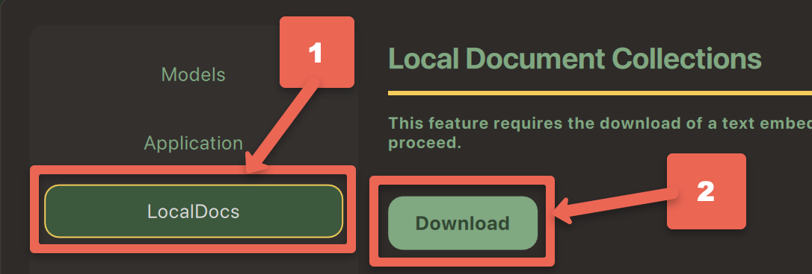
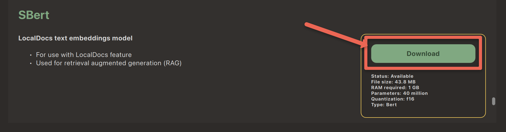

---
layout: default
title: 8 - GenAI for Local Documents
nav_order: 11
parent: Workshop Activities - Intermediate
customjs: http://code.jquery.com/jquery-1.4.2.min.js
--- 

# Use GPT4All to Query Local Documents

If you have any questions or get stuck as you work through this GPT4All exercise, please ask the instructor for assistance.

## LocalDocs Plugin Capabilities
The GPT4All _LocalDocs_ plugin allows you to query or ask questions about the contents of documents in a local folder on your computer.  LocalDocs works by creating and maintaining an index of all data in a folder on your computer that you specify. This index consists of small chunks of each document that the LLM can receive as additional input when you ask it a question. The general technique this plugin uses is called Retrieval Augmented Generation (RAG).

The main capabilities and limitations of the LocalDocs plugin include:

**LocalDocs Can:**
- Query groups of documents on your laptop with prompts or questions.
- The documents in specific folders on your computer that you specify will be searched for snippets that can be used to provide context for an answer.
- The most relevant snippets will be inserted into your prompts context, but it will be up to the underlying Large Language Model you have chosen to decide how best to use the provided context.
- **LocalDocs currently supports plain text files** (.txt, .md, and .rst) **and PDF files** (.pdf) only.

**LocalDocs Cannot:**
- Answer general metadata queries (e.g. What documents do you know about?, Tell me about my documents)
- **Summarize a single document** (e.g. Summarize my magna carta PDF.)

## Installing the LocalDocs Plugin

Let's get started installing the LocalDocs plugin for GPT4All!

1. Open GPT4All on your laptop if you haven't already.
2. Click on the **Settings** cog icon on the top right of the window.<br>
<br>
3. Select the **LocalDocs** button near the top right of the window (see #1 on the image below).
4. Click on the **Download** button.<br>
<br>
5. To the right the **SBert** model, click on the **Download** button. After SBert has downloaded click the green X in the top right to close the download window.<br>
<br>
6. Next, using your laptop's file manager, identify an existing folder or create a folder in your file manager and put files into it that you want GPT4All to query when you ask it to. You can alter the contents of the folder/directory at any time. As you add more files to your collection, your LLM will dynamically be able to access them (after 1 or 2 minutes).
   - #1 Click on the **Collection name...** field and give your collection a meaningful name. E.g. "Informal Credentials".
   - #2 Click on the green **Browse** button and navigate with your file manager to the location of the folder you want GPT4All to use as local training data.
   - #3 Click on the green **Add** button, to add your first local repository
   - #4 Close dialogue box by clicking on the green **X** in the top right corner.<br>
   <br> 
> NOTE: You can set up multiple local document repositories, but can only select one repository at a time for GPT4All to use as a data source.
7. Click on the checkbox beside the local document repository you just created (e.g. "Informal Credentials"), and then click on the green **X** in the top right corner. Note that there is now a thin yellow box around the Repository icon on the top right of the screen which indicates that a local document repository is going to be used for this chat.  
8. Start a new chat by clicking on the green **+ New chat** button session on the top left of the screen.
9. Great job! Now we'll move on to selecting a Large Language Model to work with your local document repository, and then test it to see how well it can use the local document information in responding to your prompts.

## Test LocalDocs Accuracy & Speed
1. Before we can start testing, we need to tell GPT4All that we want to use the _Llama 3 Instruct_ model:
  - Click on the **Choose a model...** drop-down box at the middle top of the window.
  - Select **Llama 3 Instruct** model. Depending on the speed of your laptop it should take between take 10 to 60 seconds for the model to finish loading.
2. Let's test _GPT4All & Llama 3 Instruct_ combined with your local document repository by asking it a question that you know the response to in your document library. For example, my local documents have information on informal credentials so I'll use the following query (**your prompte should be different**):<br>
```Are informal credentials students earn from academic makerspaces useful in helping them secure jobs?```<br>
  - How reasonable do the results look for your query?
  - Do you notice any significant errors or omissions that you know from what is in your local documents?
  - Have to tried asking for more details or for it to make a 500 word summary for example?
3. Make sure to ask another question or two that you know the answers to so that you can further evaluate the accuracy of the results! 
> - How did it do?
> - Any factual errors?
> - Any omissions?
  
[NEXT STEP: Earn a Workshop Badge](sentiment-analysis.html){: .btn .btn-blue }
