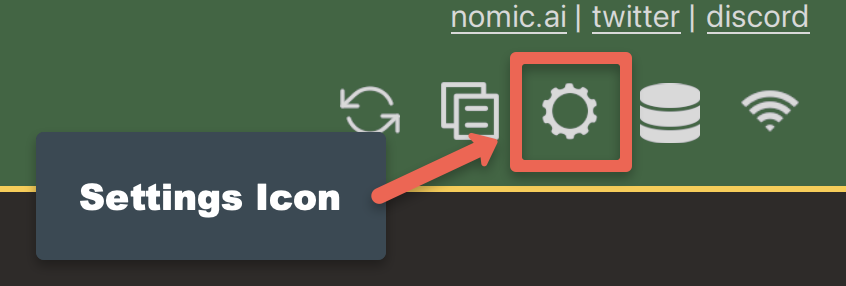
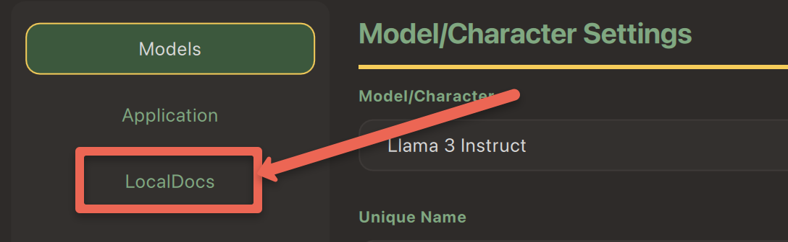

---
layout: default
title: 8 - GenAI for Local Documents
nav_order: 11
parent: Workshop Activities - Intermediate
customjs: http://code.jquery.com/jquery-1.4.2.min.js
--- 

# Use GPT4All to Query Local Documents

If you have any questions or get stuck as you work through this GPT4All exercise, please ask the instructor for assistance.

## LocalDocs Plugin Capabilities
The GPT4All _LocalDocs_ plugin allows you to query or ask questions about the contents of documents in a local folder on your computer.  LocalDocs works by creating and maintaining an index of all data in a folder on your computer that you specify. This index consists of small chunks of each document that the LLM can receive as additional input when you ask it a question. The general technique this plugin uses is called Retrieval Augmented Generation (RAG).

The main capabilities and limitations of the LocalDocs plugin include:

**LocalDocs Can:**
- Query groups of documents on your laptop with prompts or questions.
- The documents in specific folders on your computer that you specify will be searched for snippets that can be used to provide context for an answer.
- The most relevant snippets will be inserted into your prompts context, but it will be up to the underlying Large Language Model you have chosen to decide how best to use the provided context.
- **LocalDocs currently supports plain text files** (.txt, .md, and .rst) **and PDF files** (.pdf).

**LocalDocs Cannot:**
- Answer general metadata queries (e.g. What documents do you know about?, Tell me about my documents)
- **Summarize a single document** (e.g. Summarize my magna carta PDF.)

## Installing the LocalDocs Plugin

Let's get started installing the LocalDocs plugin for GPT4All!

1. Open GPT4All on your laptop if you haven't already.
2. Click on the **Settings** cog icon on the top right of the window. 

3. Select the **LocalDocs** button near the top right of the window.

4. **CONTINUE FROM HERE!**
5. Download the **SBert** model... 
7. Identify or create a folder on your computer that contains the files you want GPT4All to have access to. You can alter the contents of the folder/directory at any time. As you add more files to your collection, your LLM will dynamically be able to access them.
8. Spin up a chat session with any LLM (including external ones like ChatGPT but warning data will leave your machine!)
9. At the top right, click the database icon and select which collection you want your LLM to know about during your chat session.
10. You can begin searching with your local documents even before the collection has completed indexing, but note the search will not include those parts of the collection yet to be indexed.
11. **FINISH**

## Test LocalDocs Accuracy & Speed
1. Before we can start testing, we need to tell GPT4All that we want to use the _Llama 3 Instruct_ model:
  - Click on the **Choose a model...** drop down box at the middle top of the window.
  - Select **Llama 3 Instruct** model. Depending on the speed of your laptop it should take between take 10 to 60 seconds for the model to finish loading.
<br>
3. Let's test _GPT4All & Llama 3 Instruct_ with a generic prompt to start with. Copy and paste the following text into the Send a Message field and review the results:<br>
```Why would someone want to attend the University of Victoria in Canada? Why might the university not be a good fit for someone? Provide citations.```<br>

  - How reasonable do the results look to you?
  - Do you notice any significant omissions from the "not be a good fit" section? Housing availability? Cost of living?
3. Now let's test GPT4All with something you know a lot about:
- For Example, personal questions might be a good place to start if there was enough information on the public internet for the language models to train on: ```What is Rich McCue from the University of Victoria known for?```
> Make sure to ask a question or two of your own, keeping in mind that it's best to ask about a topic that you know a lot about so that you can evaluate the accuracy of the results! 
> - Maybe a question about your home town?
> - Or a question about a recent research project that you've completed?
  
[NEXT STEP: Earn a Workshop Badge](informal-credentials.html){: .btn .btn-blue }
