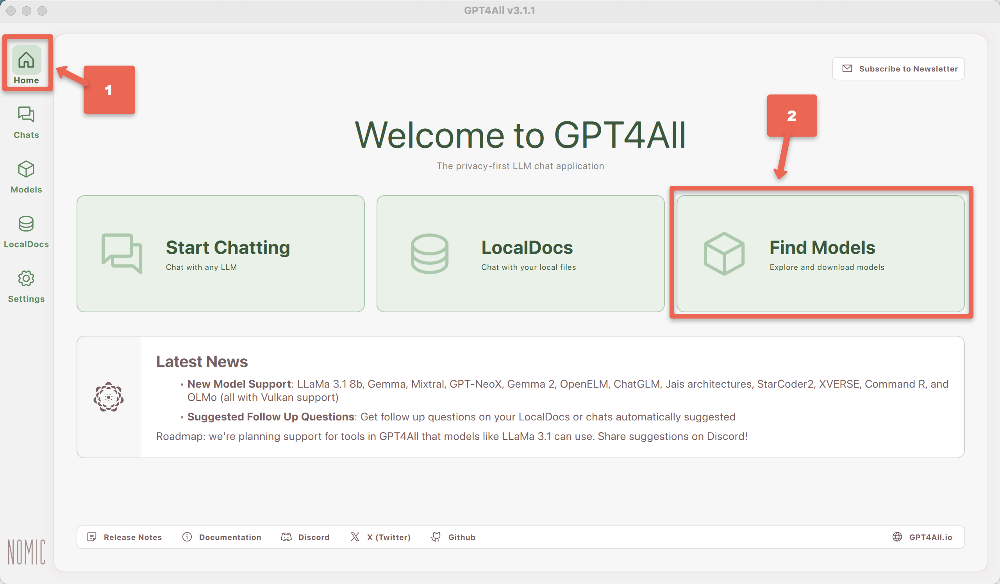
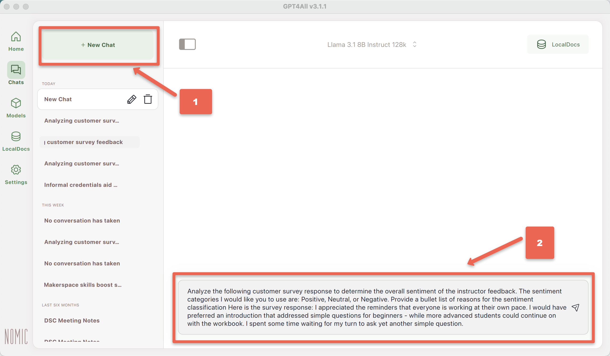
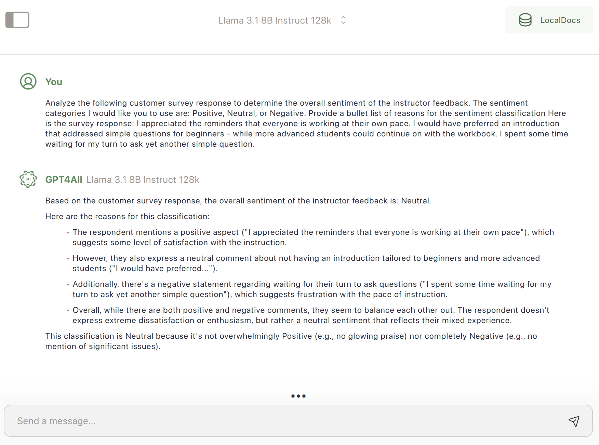
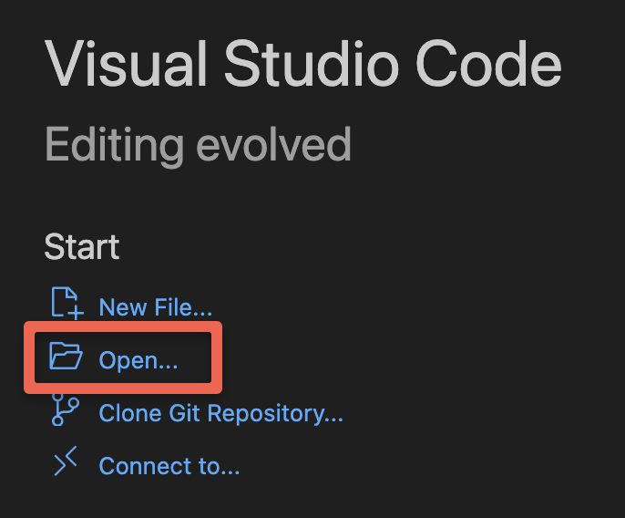

---
layout: default
title: 9 - Sentiment Analysis
nav_order: 12
parent: Workshop Activities - Intermediate
customjs: http://code.jquery.com/jquery-1.4.2.min.js
--- 
# Use GPT4All & Python for Survey Question Sentiment Analysis

Years ago as a research assistant, I worked on a project to analyze social media posts related to a specific hashtag to identify the sentiment of the tweets. While the project was very interesting, the process of manually assigning a sentiment to over 2,000 tweets was not fun at all. The good news is that Generative AI can be a helpful & efficient tool for researchers wanting to conduct similar analyses today.

In this workshop, we will explore how to use GPT4All & Python for sentiment analysis while being mindful of their limitations. If you have any questions or get stuck as you work through this GPT4All exercise, please ask the instructor for assistance.

## Capabilities & Considerations
Generative AI tools like GPT4All allow researchers to more quickly, efficiently, and reliably identify the sentiment of a sentence or short paragraph, to uncover trends and patterns. 

### Pros of using generative AI for sentiment analysis:
- Efficiency: Automatically process vast amounts of textual data in a fraction of the time it would take manual analysis.
- Insight generation: Beyond sentiment classification, generative AI can extract themes, topics, and even generate summaries of responses.
- Research Ethics: If the GenAI tool runs locally on a researcher's laptop, and does not contact the cloud, no cloud-computing disclosures are likely needed in your research ethics proposal.

### Cons of using generative AI for sentiment analysis:
- Model limitations: While powerful, generative AI models may struggle with complex language, or sarcasm.
- Potential biases: Generative AI models inherit biases present in the training data, affecting the accuracy and fairness of results.

## Install GPT4All (if you haven't already)
- If you haven't already, please install [GPT4All on your laptop](7-local-genai-intro.html){:target="_blank"} and then come back to this web page.

> NOTE: If you are on a UVic-managed computer you will need to ask your local IT staff member to install this software and Python on your laptop for you. If you're not sure who to ask to install the software, please email the UVic Computer Helpdesk for assistance: [helpdesk@uvic.ca](mailto:helpdesk@uvic.ca).

## Manual GPT4All Sentiment Analysis Test
1. Before we can start testing, we need to tell GPT4All that we want to use the _Llama 3 Instruct_ model:
  - Click on the **Home** button on the top left of the screen.
  - Click on the green **Find Models** button on the **Home** screen.
<br>
  - Select **Llama 3 Instruct** model, or the _latest Llama model_ if the _Llama 3 Instruct model_ is not available. Depending on the speed of your laptop and your internet connection, it should take between 10 seconds to 10 minutes for the model to finish loading.
2. Let's test _GPT4All & Llama 3 Instruct_ for Sentiment Analysis by clicking the green **+ New Chat** button (top left of the app), then copy and paste the following prompt into the **Send a message...** field at the bottom of the app:<br>
```Analyze the following customer survey response to determine the overall sentiment of the instructor feedback. The sentiment categories I would like you to use are: Positive, Neutral, or Negative. Provide a bullet list of reasons for the sentiment classification Here is the survey response: I appreciated the reminders that everyone is working at their own pace. I would have preferred an introduction that addressed simple questions for beginners - while more advanced students could continue on with the workbook. I spent some time waiting for my turn to ask yet another simple question.```<br>

<br>
Let's take a closer look at the "Neutral" classification that the GenAI model assigned to the survey feedback: 
> - Overall does the "Neutral" classification of the survey feedback look accurate?
> - Do the reasons that the GenAI tool gave for the "Neutral" classification look reasonable to you?
> - How would you have classified the feedback, Positive, Neutral, or Negative?
> - Do you think that this type of automated sentiment analysis could be useful in any of your upcoming research projects?

<br>

## Install Python 
Python is a programming language that is often used by researchers to assist them in analyzing their research data.
1. For Mac Computers download the most recent version of Python for your computer (Note: If you have a computer that is managed by the University of Victoria, or the company you work for, you may need to contact your IT department to install Python on your computer):
  - [Mac](https://www.python.org/downloads/macos/){:target="_blank"}
  - Install Python on your computer by finding the location your web browser downloaded the Python install file to (usually a downloads folder or your desktop), and then Double click on the installer file.
2. For Windows Computers (Note: If you have a computer that is managed by the University of Victoria, or the company you work for, you may need to contact your IT department to install Python on your computer):
   - Open the Start menu by **clicking on the Windows logo** at the bottom of your screen -OR- Press the Windows button on your keyboard.
   - Type **Microsoft Store** in the Run command box and click the **Microsoft Store icon**.
   - In the search bar at the top, type **Python** and press **Enter** on your keyboard.
   - Click on the **Free** button beside the most recent version of Python.
   - Click on the blue **Get** button to install Python on your computer.

## Install the Python GPT4All Library
In order for Python to have access to all the wonderful GPT4All tools, you need to install the GPT4All Python library:
1. If you are using a **Mac computer** please do the following:
   - Open the MacOS Terminal tool by pressing and holding the _Command_ button down, then pressing the _Space Bar_. (or _Command_ + _Space bar_).
   - Once the _Spotlight Search_ box opens, type **terminal** into the search box and then press enter. You should now have a black terminal opened on your computer.
   - In the terminal type ```pip install gpt4all``` and then press enter. If you get an error message, please ask the person leading the workshop for assistance.<br>
<br>
2. If you are using a **Windows computer** please do the following:
   - Open the Start menu by **clicking on the Windows logo** at the bottom of your screen -OR- Press the Windows button on your keyboard.
   - Type **Cmd** in the search box, and then press **Enter** button on your keyboard.
   - Type ```python3.exe -m pip install gpt4all``` and then press **Enter** button on your keyboard.

## Install a Code Editor
If you have a preferred coded editor please go ahead and use it for the following steps. If you are using a computer managed by UVic or another organization, please contact your IT department and request that they install the software for you. If you don't have a preferred code editor (or don't know what a code editor is) please do the following:
1. Download the [Visual Studio Code](https://code.visualstudio.com/download){:target="_blank"} Editor for your Mac or Windows computer.
2. Open the install file you just downloaded (it's usually found either in your download folder, or desktop).
3. Follow the installation instructions. If you have any problems installing Visual Studio Code, please ask the person leading the workshop for assistance.

# UNDER CONSTRUCTION FROM THIS POINT ON
## Use Python & GPT4All to Automate Sentiment Analysis
1. Open the Visual Studio Code you just installed (or your favourite code editor if you have one) on your laptop if you haven't already.
2. Create a new Project in Visual Studio Code by clicking on the **Open...** button.
3. You're now going to create a new folder for this project in a location on your computer where you'll be able to easily find it.
   - If you are on a Mac, click on the **Documents** menu item on the left of the dialogue box. Next click on the **New Folder** button on the bottom, and name your folder: **sentiment-analysis**, and click the blue **Create** button. Lastly, click on the blue **Open** button on the bottom right of the dialogue box. Good job!
   - If you are on a Windows computer, click on... **[INSTRUCTIONS HERE WHEN DONE]**<br>
<br>
4. Next you're going to create a file to put your Python script in, and give it a descriptive name:
   - Go to the **File** menu and then select **New Text File**.
   - Click on the **Select a language** link in the new file, then scroll down the list of languages, and select **Python**.
   - Now give the file a name by going to the **File** menu and then select **Save As...**. When prompted for the Save As file name, type in: **analysis.py** (make sure that that you only have one **.py** at the end of the file name). Click on the blue **Save** button at the bottom right of the dialogue box.
5. Let's start adding some Python code now to make sure everything is setup properly on your computer. Copy and paste the following code into the file you just created in the Visual Studio Code editor:

  from gpt4all import GPT4All
  import csv
  
  # Load the LLM you would like to use for your project
  model = GPT4All("Meta-Llama-3-8B-Instruct.Q4_0.gguf") # downloads / loads a 4.66GB LLM
  
  # Provide the prompt for the sentimate analysis here, including details like the 
  # sentimate cagetories you'd like it to use.
  prompt = "Analyze the following customer survey response to determine the overall sentiment of the instructor feedback. The sentiment categories I would like you to use are: Positive, Neutral, or Negative. Here is the survey response: "
  
  # Intialize the feedback list where we will store the feedback comments
  feedback = []
  
  # Put each of the feedback items into this list (followed by a comma, except for the last feedback). 
  # For a real research project you'd probably be reading the feedback out of an CSV file, 
  # and then writing the feedback and GenAI generated sentimate to a new CSV file.
  feedback = [
      "After the workshop, I understand how the digital dashboard works. Thank you for offering this workshop.",
      "I arrived late after the intro and demo, and my experience was great. I would be better equipped had I came on time. Rich was very helpful and we were encouraged to reach out if we need additional support.",
      "I appreciated the reminders that everyone is working at their own pace. I would have preferred an introduction that addressed simple questions for beginners - while more advanced students could continue on with the workbook. I spent some time waiting for my turn to ask yet another simple question.",
      "I find when the instructors in your courses talk, that it interrupts my concentration when I am learning. Once the self-paced activity begins, could they put they speak once and tell us that they will put comments in the chat instead?"
  ]
  
  # Loop through the list of feedback items and use the GPT4All API and the above prompt to 
  # generate verbose feedback on the type of sentiment expressed in the workshop participant feedback.
  with model.chat_session():
      for x in feedback:
          print("\n" + "Feedback: " + x) # The \n puts the Feedback text on a new line
          print("Sentiment: " + model.generate(prompt + x, max_tokens=1024))
          print("_____________________") # This is to create pysical separation between the feedbacks to that they are easier to read.

6. On the top menu click on the **File** menu, and then select **Save**.
7. More here...
9. Great job! Now we'll move on to selecting a Large Language Model to work with your local document repository, and then test it to see how well it can use the local document information in responding to your prompts.

## Test for Accuracy & Speed
1. Before we can start testing, we need to tell GPT4All that we want to use the _Llama 3 Instruct_ model:
  - Click on the **Choose a model...** drop-down box at the middle top of the window.
  - Select **Llama 3 Instruct** model. Depending on the speed of your laptop it should take between take 10 to 60 seconds for the model to finish loading.
2. Let's test _GPT4All & Llama 3 Instruct_ combined with your local document repository by asking it a question that you know the response to in your document library. For example, my local documents have information on informal credentials so I'll use the following query (**your prompte should be different**):<br>
```Are informal credentials students earn from academic makerspaces useful in helping them secure jobs?```<br>
  - How reasonable do the results look for your query?
  - Do you notice any significant errors or omissions that you know from what is in your local documents?
  - Have to tried asking for more details or for it to make a 500 word summary for example?
3. Make sure to ask another question or two that you know the answers to so that you can further evaluate the accuracy of the results! 
> - How did it do?
> - Any factual errors?
> - Any omissions?
  
[NEXT STEP: Earn a Workshop Badge](informal-credentials.html){: .btn .btn-blue }
