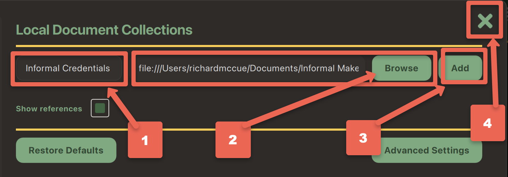

---
layout: default
title: 9 - Sentiment Analysis
nav_order: 12
parent: Workshop Activities - Intermediate
customjs: http://code.jquery.com/jquery-1.4.2.min.js
--- 
# !!!! UNDER CONSTRUCTION !!!!

# Use GPT4All & Python for Survey Question Sentiment Analysis

Years ago as a research assistant, I worked on an interesting project to analyze social media posts related to a specific hashtag to identify the sentiment of the tweets. While the project was very interesting, the process of manually assigning a sentiment to over 2,000 tweets was not fun at all. The good news is that Generative AI can be a very helpful tool for researchers wanting to conduct similar analyses today.

If you have any questions or get stuck as you work through this GPT4All exercise, please ask the instructor for assistance.

## Capabilities & Considerations
Generative AI tools like GPT4All are revolutionizing how researchers process and analyze research textual data locally on their laptops. One promising use case is using GenAI tools to perform sentiment analysis on short survey responses. Using these tools allows researchers to more quickly, efficiently, and reliably identify the sentiment of a sentence or short paragraph, to uncover trends and patterns. 

### Pros of using generative AI for sentiment analysis:

- Efficiency: Automatically process vast amounts of textual data in a fraction of the time it would take manual analysis.
- Insight generation: Beyond sentiment classification, generative AI can extract themes, topics, and even generate summaries of responses.
- Research Ethics: If the GenAI tool is running locally on a researcher's laptop, and does not contact the cloud, no cloud-computing disclosures are needed, and the use of the tool likely does not need to be written into the research ethics proposal.

### Cons of using generative AI for sentiment analysis:

- Model limitations: While powerful, generative AI models may struggle with complex language, sarcasm, or nuanced sentiment expressions.
- Potential biases: Generative AI models can inherit biases present in the training data, affecting the accuracy and fairness of results.

In this workshop, we will explore how to use GPT4All & Python for sentiment analysis while being mindful of their limitations.

## Install GPT4All (if you haven't already)

- If you haven't already, please install [GPT4All on your laptop](7-local-genai-intro.html){:target="_blank"}.

NOTE: If you are on a UVic-managed computer you will need to ask your local IT staff member to install this software and Python on your laptop for you. If you're not sure who to ask to install the software, please email the UVic Computer Helpdesk for assistance: [helpdesk@uvic.ca](mailto:helpdesk@uvic.ca).

## Test GPT4All for Sentiment Analysis

1. Before we can start testing, we need to tell GPT4All that we want to use the _Llama 3 Instruct_ model:
  - Click on the **Choose a model...** drop-down box at the middle top of the window.
  - Select **Llama 3 Instruct** model. Depending on the speed of your laptop it should take between take 10 to 60 seconds for the model to finish loading.
2. Let's test _GPT4All & Llama 3 Instruct_  by asking it...:<br>
```Are informal credentials students earn from academic makerspaces useful in helping them secure jobs?```<br>
  - How reasonable do the results look for your query?
  - Do you notice any significant errors or omissions that you know from what is in your local documents?
  - Have to tried asking for more details or for it to make a 500 word summary for example?
3. Make sure to ask another question or two that you know the answers to so that you can further evaluate the accuracy of the results! 
> - How did it do?
> - Any factual errors?
> - Any omissions?

## Install Python 

1. Put instructions here...
2. More here.

## Install Python Libraries

1. Put instructions here...

## Install a Code Editor

1. Download the [Visual Studio Code](https://code.visualstudio.com/download){:target="_blank"} Editor.
2. Install...

## Getting Started

Let's get started installing the LocalDocs plugin for GPT4All!

1. Open GPT4All on your laptop if you haven't already.
   - #2 Click on the green **Browse** button and navigate with your file manager to the location of the folder you want GPT4All to use as local training data.
   - #3 Click on the green **Add** button, to add your first local repository
   - #4 Close dialogue box by clicking on the green **X** in the top right corner.<br>
   <br> 
> NOTE: You can set up multiple local document repositories, but can only select one repository at a time for GPT4All to use as a data source.
7. Click on the checkbox beside the local document repository you just created (e.g. "Informal Credentials"), and then click on the green **X** in the top right corner. Note that there is now a thin yellow box around the Repository icon on the top right of the screen which indicates that a local document repository is going to be used for this chat.  
9. Great job! Now we'll move on to selecting a Large Language Model to work with your local document repository, and then test it to see how well it can use the local document information in responding to your prompts.

## Test LocalDocs Accuracy & Speed
1. Before we can start testing, we need to tell GPT4All that we want to use the _Llama 3 Instruct_ model:
  - Click on the **Choose a model...** drop-down box at the middle top of the window.
  - Select **Llama 3 Instruct** model. Depending on the speed of your laptop it should take between take 10 to 60 seconds for the model to finish loading.
2. Let's test _GPT4All & Llama 3 Instruct_ combined with your local document repository by asking it a question that you know the response to in your document library. For example, my local documents have information on informal credentials so I'll use the following query (**your prompte should be different**):<br>
```Are informal credentials students earn from academic makerspaces useful in helping them secure jobs?```<br>
  - How reasonable do the results look for your query?
  - Do you notice any significant errors or omissions that you know from what is in your local documents?
  - Have to tried asking for more details or for it to make a 500 word summary for example?
3. Make sure to ask another question or two that you know the answers to so that you can further evaluate the accuracy of the results! 
> - How did it do?
> - Any factual errors?
> - Any omissions?
  
[NEXT STEP: Earn a Workshop Badge](informal-credentials.html){: .btn .btn-blue }
